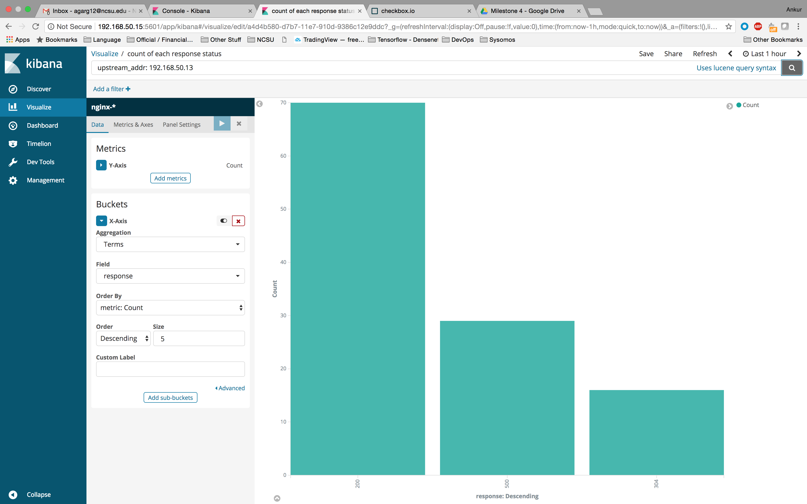

# DevOps Milestone 4: Cluster Monitoring Agent
We have implemented a Cluster Monitoring Agent (based on circuit breaker pattern) and an Auto-Recovery Agent

## Overall Project Video Presentation

https://www.youtube.com/watch?v=bfyCV9SgoC8

## Micro Service Cluster
We use Checkbox.io application for this purpose. We have created a cluster of 2 nodes running checkbox.io application.  
A Third node is used to run a load balancer.

## NGINX Load Balancer
We have used Nginx load balancer to manager the 2-node cluster.

## ELK
To analyze and manage the logs from nginx load balancer we use the `logstash`, `Elastic Search` and `Kibana`. Logstash parses the logs from nginx and stores them in  Elastic Search and Kibana is used for visualization.

## Redis
We use redis master-slave configuration to set flags and to maintain list of active and inactive nodes of the cluster. This helps in ensuring that each of the two agents as well as the ELK stack can be run on separate machines.

## Monitoring Agent
It is a nodejs application which gets the list of active nodes from redis. For each node collects statistics by querying elastic search. Detects any node as "unhealthy" if any statistic crosses the threshold. Such nodes are removed from load balancer and are added in 'inactive_nodes' in redis. This script runs forever and checks all nodes once every 30 mins. Each time a node is detected to be unhealthy, an email is sent to admin.

### Statistics used
- Percentage of requests for a particular node that returned with 500 error code in the last 30 mins.
- Average time to process a single request for a particular node in last 30 mins.

## Auto-Recovery Agent
This is another nodejs application which gets the list of inactive nodes from redis. For each node it runs recovery. In this project, we are restarting the checkbox.io server.js forever service on the "unhealthy" node. After resolving the issues, it updates the 'active_nodes' and 'inactive_nodes' in redis and also adds it back in nginx load balancer. This script runs forever and checks for inactive nodes once every 5 mins. Each time a node is recovered, an email is sent to admin.

## To Run this:
- Add from_email and passowrd in agent.js and auto_recovery.js files
- Add ssh keys for each of the nodes of the cluster in playbooks/roles/load_balancer/files/keys/ directory (format mentioned in readme)
- update the interval at which agents are run, manually inside the scripts.

## Screencast - Demonstration of Milestone 4 (Only Milestone 4 Video)

https://www.youtube.com/watch?v=TElBc-kR91E

## Contributions:

- Abhimanyu Jataria and Debosmita Das: Auto-Recovery Agent
- Ankur Garg and Atit Shetty: ELK and Monitoring Agent